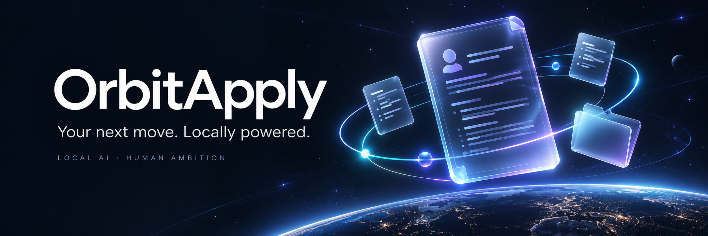
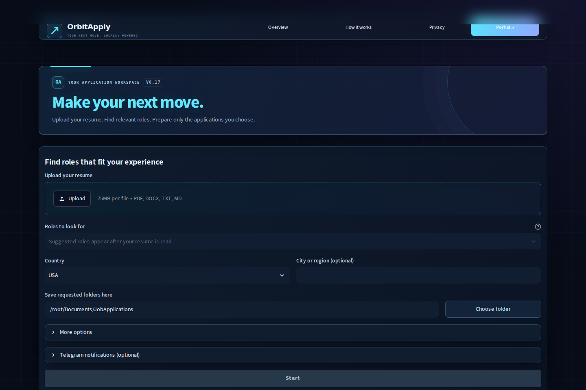
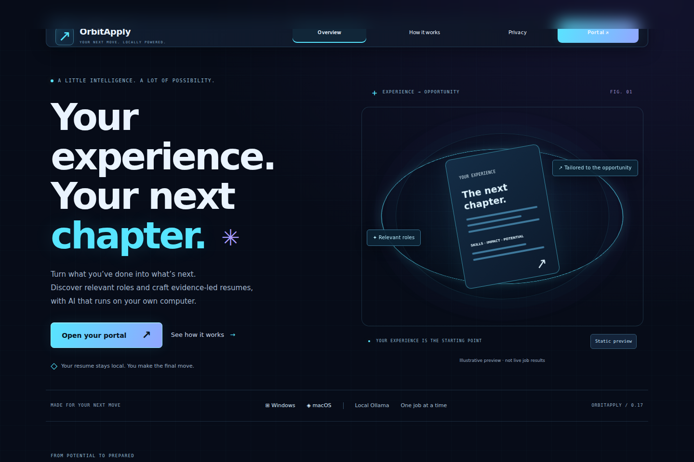

<div align="center">



# Your experience. Your next opportunity.

**Find relevant roles. Prepare a résumé for each one. Keep the final say.**

A local AI workspace for job discovery, résumé tailoring, and application prep.  
Powered by **Ollama** · Built for **Windows + Apple-silicon Mac** · **One job at a time**

[Quick start](#quick-start) · [See the app](#see-the-app) · [How it works](#how-it-works) · [Contribute](#build-with-us)

</div>

---

## Spend less time preparing. More time choosing.

Job hunting means repeating the same work: finding roles, reading descriptions,
adapting your résumé, and keeping track of applications.

OrbitApply brings that preparation into one workspace. Upload your résumé, choose
the roles you want, and create an application folder for each opportunity worth
pursuing. Your local model helps with the draft. **You review it and apply yourself.**

| Find your fit | Prepare with context | Stay in control |
| :--- | :--- | :--- |
| Suggested role titles from your résumé, with location, recency, and sponsorship preferences. | Job requirements mapped to résumé evidence, with PDF and editable DOCX drafts. | Choose which jobs to queue, process one at a time, and track confirmed applications. |

## See the app



*Actual v0.17 portal, before a résumé is uploaded. Captured locally with reduced motion.*

<details>
<summary><strong>Explore the sci-fi overview</strong></summary>



The landing page includes bundled Three.js artwork, a pause-motion control,
and a direct route into the portal. The animation stops when you enter the portal.

</details>

## How it works

| Step | You do this | OrbitApply does this |
| :--- | :--- | :--- |
| **01 · Upload** | Add a text-based PDF, DOCX, TXT, or Markdown résumé. | Parses your experience and suggests role titles to search. |
| **02 · Discover** | Choose roles, location, dates, and optional sponsorship preferences. | Searches for listings and presents the results. You can cancel the search. |
| **03 · Queue** | Click **Create folder** on the jobs you want. | Queues your choices and tailors one résumé at a time. Other jobs can still be added or removed from the waiting queue. |
| **04 · Review** | Open the folder and check the draft and report. | Saves the job description, application link, résumé documents, and review status. |
| **05 · Apply** | Open the employer page, submit, then confirm **Yes, I applied**. | Records the application locally so matching postings can be hidden in later searches. |

**Each folder has a purpose.** A successful tailoring run includes:

| File | What it gives you |
| :--- | :--- |
| `Tailored_Resume.pdf` + `Tailored_Resume.docx` | A readable PDF and an editable draft in a simple ATS-readable layout. |
| `Job_Description.pdf` + `Job_Description.txt` | The job description used for preparation. |
| `APPLY_HERE.html` + `Application_Link.txt` | A direct route to the application page. |
| `Tailoring_Report.html` + `STATUS.txt` | The tailoring review and completion status. |
| `AI_Usage.json` | Reported model usage and payload-reduction estimates. |

Folder names follow **candidate_company_role** within your chosen save location.

> **A draft should earn the “tailored” label.** Incomplete, unchanged, or unaligned
> results use separate review statuses and filenames. Check the status and report
> before submitting. An ATS-readable layout is not a guarantee of an ATS score.

## Quick start

**You need:** 64-bit Python **3.11–3.14**, [Ollama](https://ollama.com/download),
and several GB of free space for the model and dependencies.
On Apple silicon, use native ARM64/universal2 Python.

1. Download the repository ZIP from **Code → Download ZIP**, or use a release ZIP if available.
2. Extract it into a writable folder and open that folder.
3. Install and open Ollama, then run your platform's setup file once:

| Platform | Setup once | Launch each time |
| :--- | :--- | :--- |
| **Apple-silicon Mac** | `setup_macos.command` | `run_macos.command` |
| **Windows** | `setup_windows.bat` | `run_windows.bat` |

4. Wait for setup to finish, then run the launcher. Keep its terminal window open.
5. Open **[localhost:8501](http://127.0.0.1:8501)** in your browser and select **Portal ↗**.

Setup downloads Python dependencies, the retrieval browser, and `qwen3:8b`.
The starting configuration is an **8192-token context** with **one tailoring job
at a time**. Performance depends on your model and available memory.

**First installation?** [Follow the full setup guide](START_HERE.md).  
**Already running OrbitApply?** [Read the upgrade steps](START_HERE.md#upgrading-from-an-older-version).

<details>
<summary><strong>Mac: if double-clicking a launcher does not work</strong></summary>

Open Terminal, type `bash` followed by a space, drag the setup file into Terminal,
and press Return. Do the same with the launch file after setup completes.
Keep the terminal open while using the app.

</details>

## Local AI, with clear boundaries

- **Local inference by default.** Résumé analysis and tailoring run through Ollama.
  Job searches still use the internet and send search terms to external sites.
  Optional Telegram notifications also use an external service.
- **Evidence-aware drafting.** Requirements, source evidence, and draft claims are
  checked. Model mistakes remain possible, so every draft needs your review.
- **Sponsorship context.** Role-specific offers, conditions, and exclusions matter.
  Employer sponsorship history is a signal, not proof that a particular role qualifies.
- **Human submission.** OrbitApply prepares documents and opens application links.
  You complete and submit the application.

<details>
<summary><strong>How context protection and compression work</strong></summary>

Long descriptions are processed in bounded sections. Context guards reject
oversized requests rather than silently cutting off the source.

The built-in compressor compacts app-owned JSON and removes redundant generated
schema labels. It preserves source résumé/JD text, field values, constraints,
numbers, and negations, and makes no extra model calls.

Four synthetic fixtures measured **4.3–13.21% fewer payload characters**.
Those are offline character measurements, not measured token savings or
inference speedups. The app reports Ollama usage separately when available.

This is an original implementation of compression principles.
**No external “AI Agent Content Compress” plugin or Headroom code is bundled.**

Read [the compression design](docs/COMPRESSION.md) and
[the validation results](VALIDATION.md).

</details>

<details>
<summary><strong>Current limits and application history</strong></summary>

Blocked job sites, scanned PDFs, incomplete listings, and model errors can
prevent preparation. OrbitApply cannot promise exhaustive search coverage,
sponsorship, a completed draft for every listing, or an interview.

Application history is local to each computer. It uses the résumé email, with a
name fallback; keep the same email across résumé versions to reuse that history.
Existing installations retain the legacy `LocalJobTailor` data directory.

This is a Python source distribution with a browser interface, not a signed
standalone desktop binary.

</details>

## Build with us

Useful contributions include a reproducible job-page extraction bug, a
privacy-safe résumé parsing fixture, a clearer setup step, or a measured
performance improvement.

Read [CONTRIBUTING.md](CONTRIBUTING.md) before contributing and
[SECURITY.md](SECURITY.md) for security reports. Use synthetic data in issues and
screenshots; keep personal résumés and credentials out of the repository.

```sh
python -m pip install -r requirements.txt
python -m unittest discover -s tests -q
python benchmarks/measure_payload.py
```

The last recorded validation passed **148 tests** using synthetic data and mocked
model/network responses on Linux. Native hardware performance and live-model
quality are not established by those tests. [See the full scope](VALIDATION.md).

[GitHub setup](GITHUB_SETUP.md) · [Project presentation kit](docs/GITHUB_PRESENTATION.md) ·
[Changelog](CHANGELOG.md) · [Third-party notices](THIRD_PARTY_NOTICES.md)

<details>
<summary><strong>Attribution and license status</strong></summary>

OrbitApply was previously called Local Job Tailor. Three.js notices are retained,
and the existing context guard retains its Headroom-inspired attribution.

The owner has not yet selected a license for the app's original code.
Review [THIRD_PARTY_NOTICES.md](THIRD_PARTY_NOTICES.md), including dependency
licensing, before a public release. Publishing source alone does not grant an
open-source license.

OrbitApply is a working name; trademark and package-name availability have not
been established.

</details>

---

<div align="center">

**Make your next move. Locally powered.**

If OrbitApply is useful to you, a **star**, a thoughtful issue, or a shared demo
helps more people find it.

<sub>OrbitApply v0.17.0 · Local AI · Human-reviewed applications</sub>

</div>
